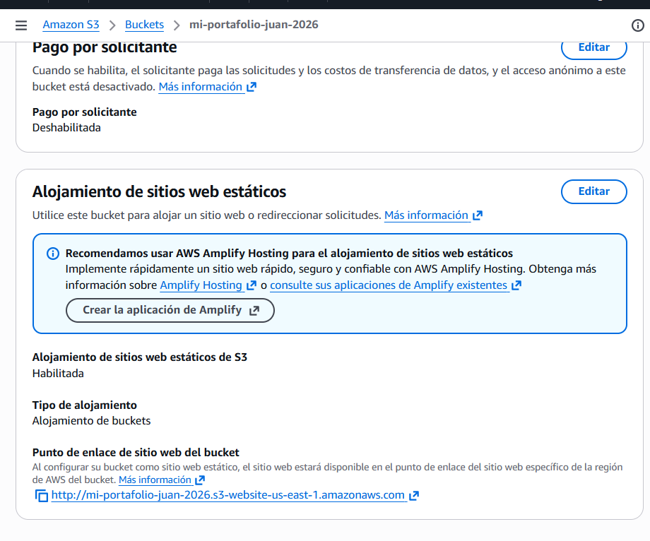
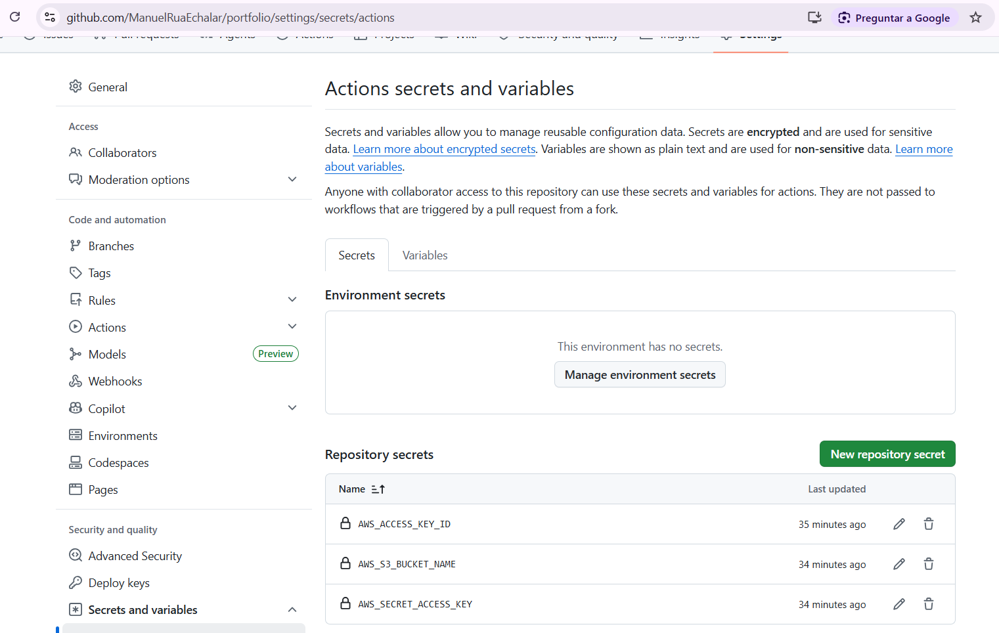
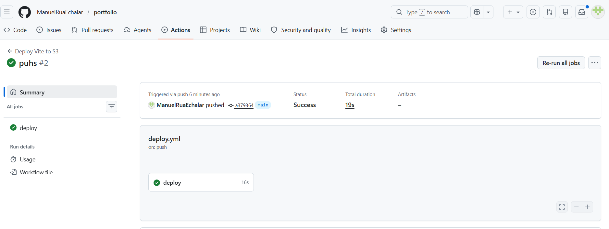
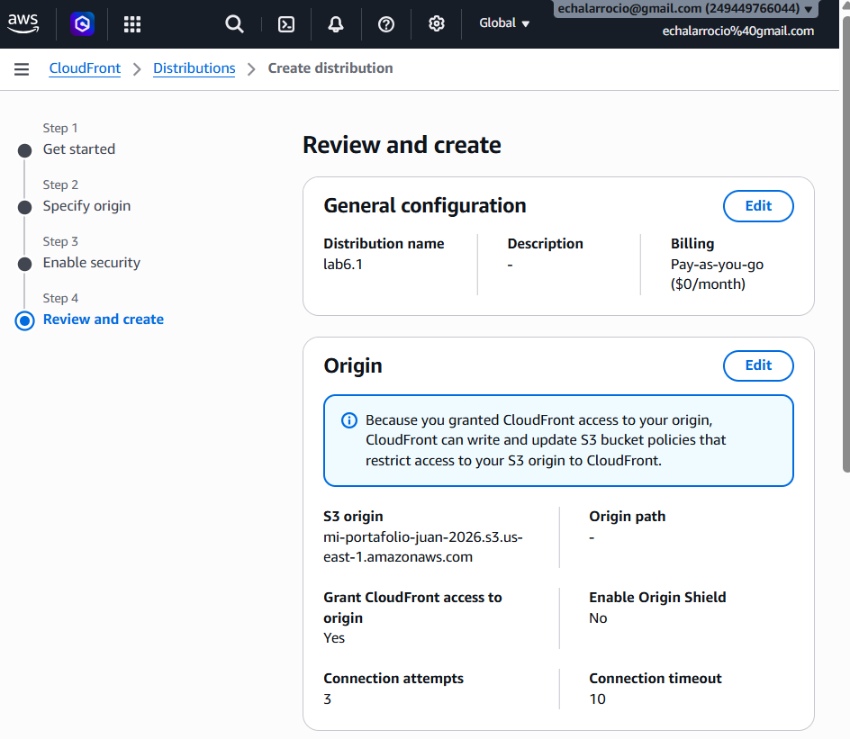
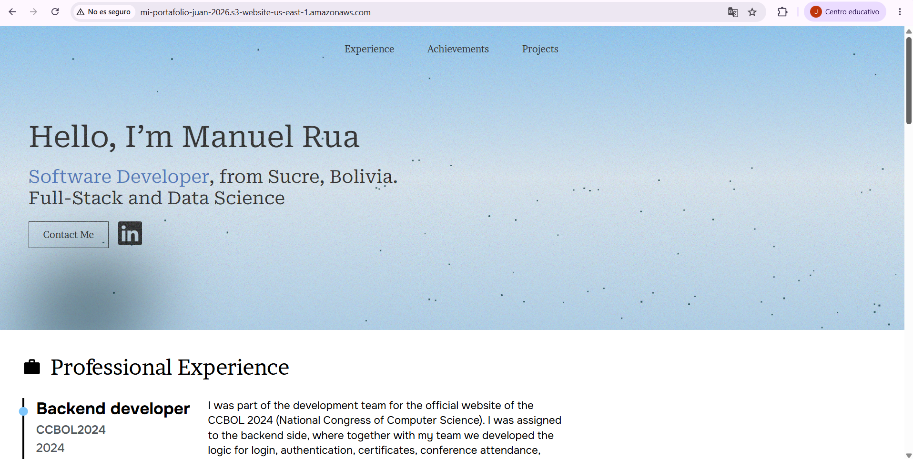
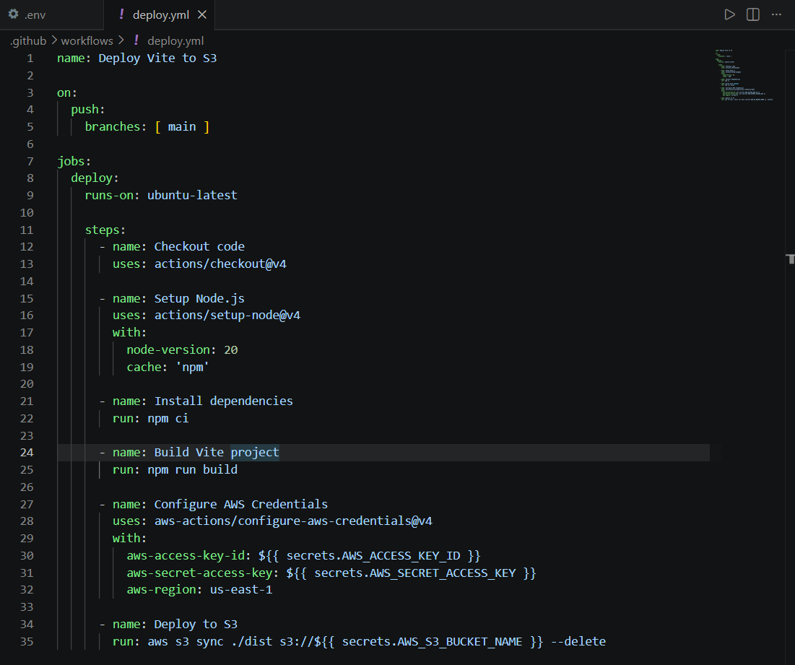

# Informe del Laboratorio: Despliegue Continuo de Sitio Estático

## 1. Descripción del Sitio y del Pipeline
El proyecto consiste en un portafolio web personal, migrado de HTML puro a un proyecto modular construido con el framework Vite (que optimiza HTML, CSS y JavaScript). 

El pipeline de Despliegue Continuo (CD) está configurado usando **GitHub Actions**. El flujo de trabajo realiza las siguientes tareas automáticamente con cada `push` a la rama principal:
1. Hace checkout del código fuente.
2. Instala dependencias e inicializa la compilación con Vite (`npm run build`).
3. Configura las credenciales de AWS de manera segura mediante GitHub Secrets.
4. Sincroniza la carpeta generada `dist/` con el bucket S3 usando `aws s3 sync` (con la bandera `--delete` para limpiar archivos obsoletos).
5. Invalida la caché de **Amazon CloudFront** para reflejar los últimos cambios en la CDN de manera inmediata.

---

## 2. Evidencias (Capturas de Pantalla)

### A. Bucket S3 configurado para hosting web

### B. Secretos y variables configurados en GitHub

### C. Historial de ejecuciones en la pestaña Actions
*Historial mostrando los despliegues ejecutados en el flujo de trabajo de GitHub Actions.*

### D. Distribución de CloudFront configurada (OAC)

### E. El sitio web funcionando (URLs públicas)
- **URL S3:** [http://mi-portafolio-juan-2026.s3-website-us-east-1.amazonaws.com](http://mi-portafolio-juan-2026.s3-website-us-east-1.amazonaws.com)

### F. Código de Despliegue (Deploy Workflow)

---

## 3. URLs de Acceso

- **URL Pública (S3/CloudFront):** `http://mi-portafolio-juan-2026.s3-website-us-east-1.amazonaws.com`
- **URL del Repositorio:** `https://github.com/ManuelRuaEchalar/portfolio`

---

## 4. Conclusiones
El uso de un despliegue continuo (CD) para sitios estáticos aporta un valor inmenso al ciclo de desarrollo. Principalmente:
- **Automatización y Prevención de Errores:** Elimina la necesidad de compilar localmente y subir archivos de forma manual mediante FTP o la consola de AWS, lo que reduce el error humano.
- **Eficiencia y Rapidez:** Cualquier cambio en el código se refleja en producción en cuestión de segundos o minutos tras hacer un `push`.
- **Escalabilidad y Rendimiento:** Al integrar CloudFront (CDN) sobre S3, no solo servimos el contenido de manera ultrarrápida a nivel global mediante cachés en los nodos de borde, sino que el OAC añade una capa crucial de seguridad al evitar el acceso directo o malintencionado al bucket origen.
- **Trazabilidad:** GitHub Actions deja un registro claro de cada despliegue, permitiendo detectar en qué momento exacto se introdujo un fallo (y revertirlo fácilmente).
